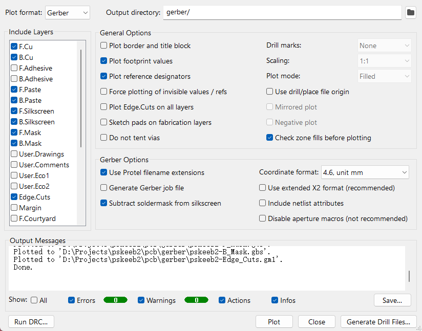

# PSKeeb 2

## Features

- Tenting design - good for RSI symptoms
- Stackable - portable
- 36 keys columnar layout - less movement when typing
- Trackpoint support

## Designs

- [pskeeb1 gateron ks27](pskeeb1_gateron_ks27): Mainly designed for Gateron KS27 low profile switches, Blackpill controller, Diodeless
- [pskeeb2 express](pskeeb2_express): All Kinds of switches, Blackpill controller, Diodeless, 9.2x9.2cm PCB
- [pskeeb3 cherry hotswap](pskeeb3_cherry_hotswap): Cherry MX Switch, Raspberry Pi Pico, Diodeless

## Assembly

#### Trackpoint

1. Follow [this great guide](https://github.com/alonswartz/trackpoint#q-how-do-i-identify-the-trackpoint-pinout) and [this topic](https://geekhack.org/index.php?topic=115912.0) to identify the trackpoint pinout
2. Solder GH cable to the trackpoint by refering to the socket wiring sequence: RST/DAT/CLK/GND/VCC (top to bottom)


## Developement

```
git clone https://github.com/klesh/pskeeb.git
git submodule update --init --recursive
```

Use the following options when exporting gerber for JLCPCB manufactoring.
