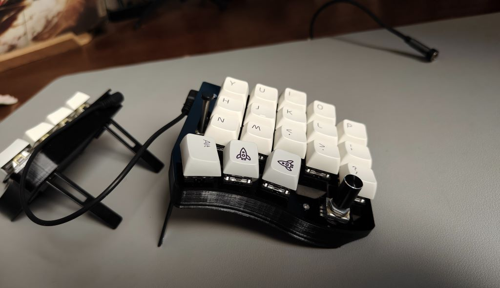
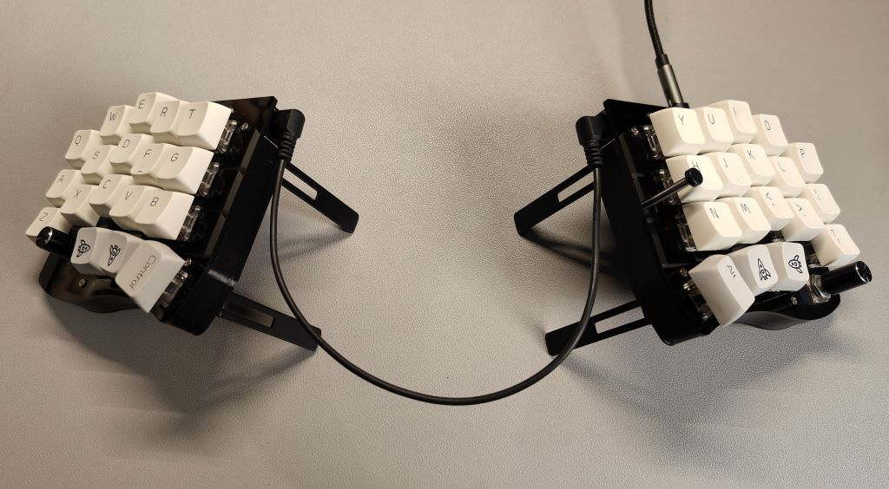
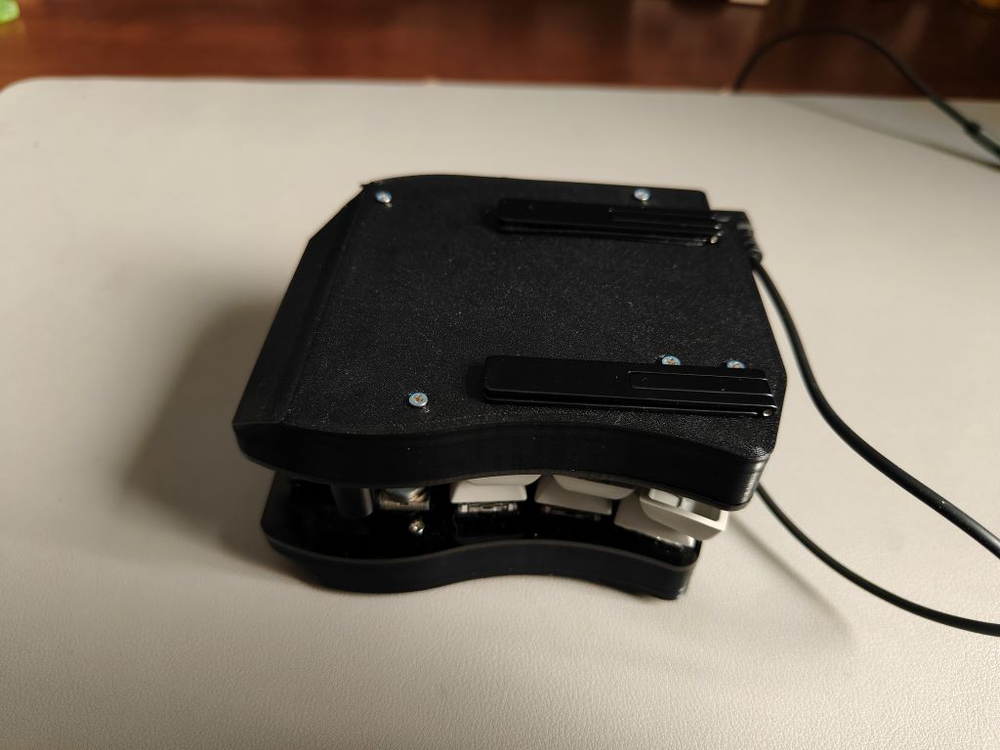

# PSKeeb 2.5 - Cherry MX Switch

## Preview





## Features

- 9.2 x 9.2 cm PCB which is cheap to order from PCB manufacturer 
- Diodeless design - easy to build
- Tenting design - good for your wrists, shoulders and back
- Stackable - portable
- 36 keys columnar layout - fast typing
- Trackpoint support

## BOM

- [Laser cut acrylic top plate](release/pskeeb2.5-topplate.dxf)
- [3D printed case](release/pskeeb2.5-case.stl) x 2pcs (one of them must be mirrored in your slicing software)
- Blackpill stm32f401 x 2pcs
- m2x5 screw x 24pcs for plates and cases
- PJ-320A TRRS headphone jack x 2pcs / 3.5mm TRRS cabck 4 Pole x 1pc
- m2x7 screw and m2x1(thickness) washer x 2pcs each for mouting trackpoint
- GH 1.25mm Pitch 1x05 pins and cable x 1pc for trackpoint connection
- m2x13mm female-to-female brass standoff x 12pcs
- 2.2uF Capcitor x 1pc / 100k Resistor x 1pc / 4.7k Resistor x 2pcs for trackpoint reset circuit
- 3.5(outer)x0.2(thickness)x3.1mm(inner) stainless steel tube x 1pc / Silicon rubber cap for trackpoint extending x 1pc
- Thin phone stand x 2pc
- MX Switches x 36pcs / keycaps x 36pcs
- EC11 rotary encoder and knob x 2pcs
- Optional 2.54mm pitch single row socket with 3.5mm profile x 2pcs for mounting MicroController

## Assembly


Video to be uploaded

### Trackpoint

1. Follow [this great guide](https://github.com/alonswartz/trackpoint#q-how-do-i-identify-the-trackpoint-pinout) and [this topic](https://geekhack.org/index.php?topic=115912.0) to identify the trackpoint pinout
2. Solder GH cable to the trackpoint by refering to the socket wiring sequence: RST/DAT/CLK/GND/VCC (top to bottom)

## Fireware and keymap

1. [Download the firmware](https://github.com/klesh/pskeeb2/releases/download/v2.5/pskeeb2_vial.bin) and follow the [QMK doc](https://docs.qmk.fm/#/newbs_flashing) to flash the Blackpills
2. [Download the vial](https://get.vial.today/download/) and use it to configure your keymap
 

# Developement

```
git clone https://github.com/klesh/pskeeb2.git
git submodule update --init --recursive
```
